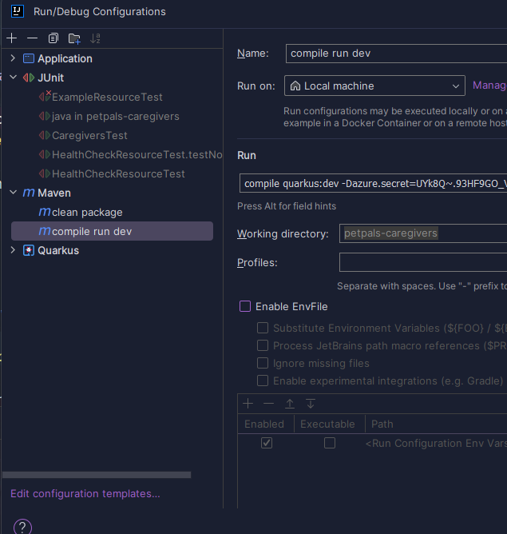
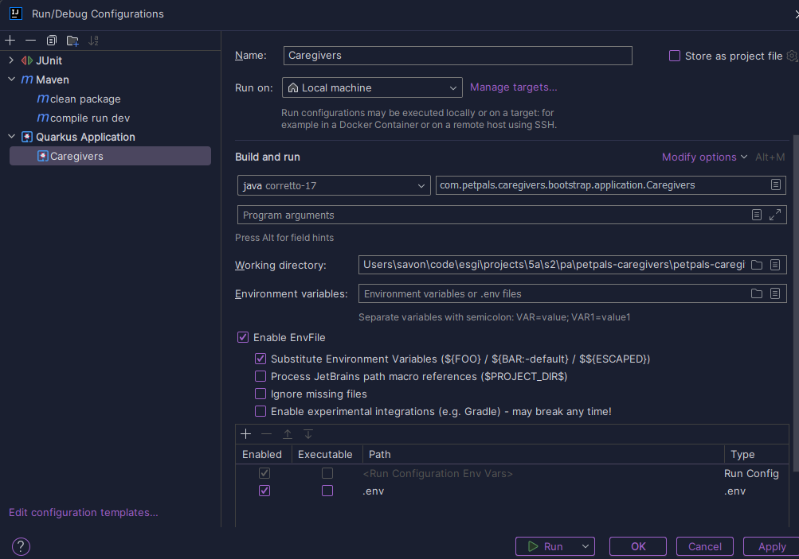
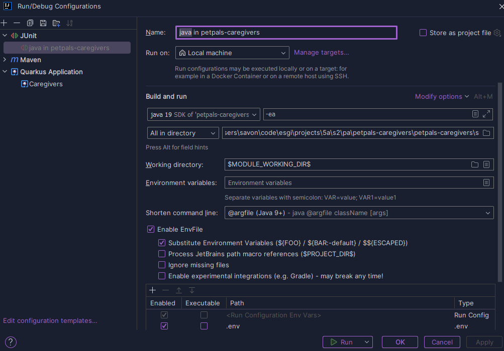

<style>
r { color: Red }
o { color: Orange }
g { color: Green }
b {color: #ff6e7f}
c { color: #DA22FF}
p {color:#bfe9ff}
</style>


# <o>petpals-caregivers</o>
## <c>Prerequisites</c>
This project uses Quarkus, the Supersonic Subatomic Java Framework.

If you want to learn more about Quarkus, please visit its website: https://quarkus.io/ .
> - Java 17
> - Maven 3.9.6
> - Intellij Ultimate
> - local sonarqube server (not mandatory)

!! To run the project localy without docker, you need to set the quarkus.http.port/host to 127.0.0.1 and any available port ,and the azure key vault credentials as environment variable (cli argument or register thee variables in your OS) as in the image below !!





## <b>Running the application in dev mode</b>

You can run your application in dev mode that enables live coding using:

```shell script
./mvnw compile quarkus:dev
```

> **_NOTE:_**  Quarkus now ships with a Dev UI, which is available in dev mode only at http://localhost:8080/q/dev/.

## <b>Packaging and running the application</b>

The application can be packaged using:

```shell script
./mvnw package
```

It produces the `quarkus-run.jar` file in the `target/quarkus-app/` directory.
Be aware that it’s not an _über-jar_ as the dependencies are copied into the `target/quarkus-app/lib/` directory.

The application is now runnable using `java -jar target/quarkus-app/quarkus-run.jar`.

If you want to build an _über-jar_, execute the following command:

```shell script
./mvnw package -Dquarkus.package.type=uber-jar
```

The application, packaged as an _über-jar_, is now runnable using `java -jar target/*-runner.jar`.

## <b>Creating a native executable</b>

You can create a native executable using:

```shell script
./mvnw package -Dnative
```

Or, if you don't have GraalVM installed, you can run the native executable build in a container using:

```shell script
./mvnw package -Dnative -Dquarkus.native.container-build=true
```

You can then execute your native executable with: `./target/petpals-caregivers-1.0-SNAPSHOT-runner`

If you want to learn more about building native executables, please consult https://quarkus.io/guides/maven-tooling.

## <b>Related Guides</b>

- Hibernate ORM ([guide](https://quarkus.io/guides/hibernate-orm)): Define your persistent model with Hibernate ORM and
  Jakarta Persistence
- Hibernate Validator ([guide](https://quarkus.io/guides/validation)): Validate object properties (field, getter) and
  method parameters for your beans (REST, CDI, Jakarta Persistence)
- Jacoco - Code Coverage ([guide](https://quarkus.io/guides/tests-with-coverage)): Jacoco test coverage support
- OpenID Connect ([guide](https://quarkus.io/guides/security-openid-connect)): Verify Bearer access tokens and
  authenticate users with Authorization Code Flow
- Scheduler ([guide](https://quarkus.io/guides/scheduler)): Schedule jobs and tasks
- Logging JSON ([guide](https://quarkus.io/guides/logging#json-logging)): Add JSON formatter for console logging
- JDBC Driver - PostgreSQL ([guide](https://quarkus.io/guides/datasource)): Connect to the PostgreSQL database via JDBC

## <b>Provided Code

### Hibernate ORM</b>

Create your first JPA entity

[Related guide section...](https://quarkus.io/guides/hibernate-orm)

### <b>RESTEasy JAX-RS</b>

Easily start your RESTful Web Services

[Related guide section...](https://quarkus.io/guides/getting-started#the-jax-rs-resources)
